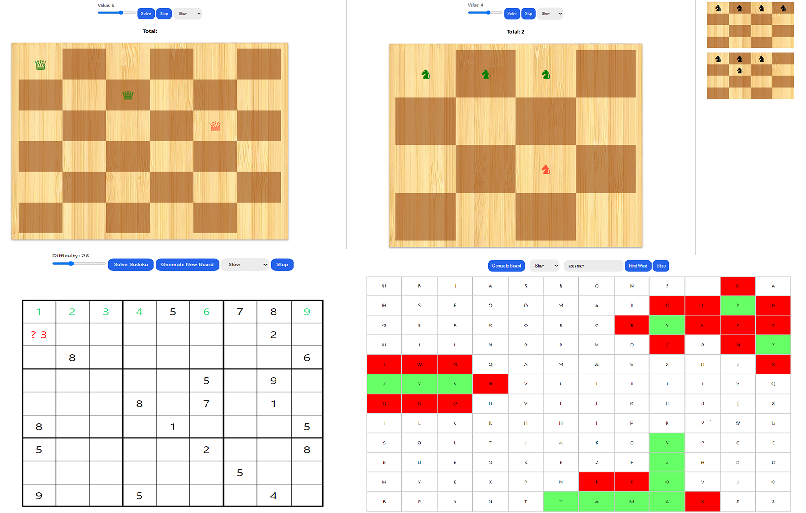

# About

Visualization app that displays the solving process of four backtracking problems: 

- Sudoku solver
- N-Queens
- N-Knights
- Word-Search

# Setup

Clone the repository

```
$ git clone https://github.com/Koki131/backtrack-visualizer.git
```

```
$ npm run build
```

### Live demo
https://backtrack-visualizer.netlify.app/

### Preview

